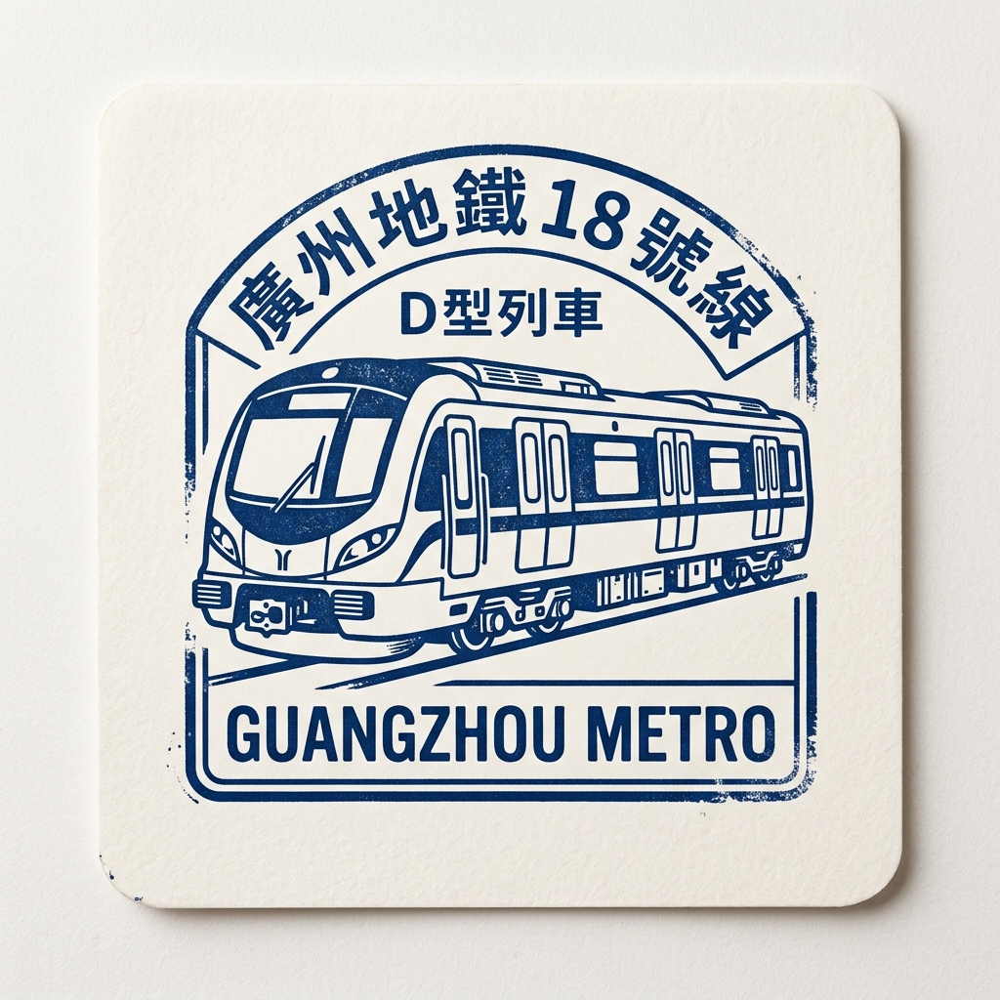

# Line 18 — The Speed Champion!

## Quick Intro
Line 18 is Guangzhou's fastest metro line.
It travels 58 kilometers underground from Wanqingsha (万顷沙) in the south all the way to Xiancun (冼村) in the north.
Express trains skip stations and travel at up to 160 kilometers per hour — the fastest of any metro line in China!

## Story Time
Nansha is a special area in the far south of Guangzhou, close to the sea.
For a long time, people living there had no fast way to reach the city center.
Driving could take over an hour when the roads were busy.
As Guangzhou began to build Nansha into a new international business zone, leaders wanted a fast metro link to tie it to the rest of the city.

Line 18 was planned as Guangzhou's first express metro line — a line that could carry passengers at speeds more like a train between cities, not just a regular city metro.
Construction started in 2018, and on September 28, 2021, Line 18 officially opened.
For the first time, someone living in Wanqingsha (万顷沙) could reach the heart of Guangzhou in about 30 minutes by express train.

Today, Line 18 is a key link in Guangzhou's plans to grow Nansha as a world-class city and as part of the Greater Bay Area.

## Time Story
- 2018: Construction of Line 18 began.
- 2021: Line 18 opened on September 28, running 58.3 km from Wanqingsha (万顷沙) to Xiancun (冼村).
- Today: The line continues to serve as the fastest metro link between Nansha and the city center.

Building 58 km of underground tunnels to handle the speed of 160 km/h took about three years of intensive work.

## Challenges Along the Way
- Soft and watery ground: The Pearl River Delta has soft mud, sand, and lots of groundwater underground. Workers had to be very careful to stop the tunnels from flooding and to prevent the ground above from sinking.
- Tunneling under rivers: Line 18 crosses 11 rivers, each more than 200 meters wide. Boring tunnels under rivers is one of the hardest jobs in underground construction.
- World's largest TBM fleet: To build the tunnels quickly enough, engineers used 52 giant Tunnel Boring Machines working at the same time — the most ever used for a single project in the world. Coordinating so many machines at once was an enormous challenge.

## Route Snapshot
- **Start area**: Wanqingsha (万顷沙) — Nansha District, south
- **End area**: Xiancun (冼村) — Tianhe District, north
- **Route role**: High-speed express link between Nansha and Guangzhou's city center
- **Transfer value**: Connects to Line 3 and Line 22 at Panyu Square (番禺广场); Line 7 at Nancun Wanbo (南村万博); Line 11 at Longtan (龙潭); and Line 8 and Line 12 at Modiesha (磨碟沙)

## Full Station List

1. **Wanqingsha** (万顷沙) 🔄 Intercity Rail
2. **Hengli** (横沥)
3. **Panyu Square** (番禺广场) 🔄 Line 3, Line 22
4. **Nancun Wanbo** (南村万博) 🔄 Line 7
5. **Shaxi** (沙溪)
6. **Longtan** (龙潭) 🔄 Line 11
7. **Modiesha** (磨碟沙) 🔄 Line 8, Line 12
8. **Xiancun** (冼村) 🔄 Line 13 (Future)

## Important Stations for Kids

### 1) Wanqingsha (万顷沙) Station
This is the southern starting point of Line 18, deep in the Nansha area near the sea.
Wanqingsha (万顷沙) means "ten thousand green sands" in Chinese — a beautiful name for a quiet, growing area.
The city plans to turn this area into a big international hub in the future.

### 2) Panyu Square (番禺广场) Station
This busy station is in the heart of Panyu District.
Here you can change to Line 3 or Line 22.
It is like a great meeting point where travellers from many parts of Guangzhou cross paths!

### 3) Xiancun (冼村) Station
This station is in Tianhe District, one of the most modern and lively parts of Guangzhou.
Arriving here from Wanqingsha (万顷沙) on an express train takes only about 30 minutes!

## Fun Facts
- Line 18's trains can reach 160 km/h — faster than most cars on a motorway!
- During speed tests, trains on Line 18 reached 176 km/h, setting a record for urban metro lines in China.
- Line 18 is fully underground for its entire 58.3 km length — there are no above-ground sections at all.

## Word Helper
- Express train: A train that stops only at certain stations and travels faster between them.
- TBM (Tunnel Boring Machine): A giant round drilling machine used to dig tunnels through rock and soil.
- Pearl River Delta: The flat land around the Pearl River mouth in southern Guangdong, where many rivers meet the sea.

## Memory Check
1. When did Line 18 first open?
2. What is the top speed of Line 18's trains?
3. How many rivers do Line 18's tunnels cross?

## Photos

### Photo 1

- Caption: A Guangzhou Metro Line 18 train in 2021. Photo by Zhao Jiale.
- Source: [TrainNets](https://www.trainnets.com/archives/55949)
- Photographer/Author: Zhao Jiale.
- Risk note: Medium. Public web image from TrainNets; licensing or reuse terms are not clearly stated on the page, and external link availability may change.

### Photo 2

- Caption: A Guangzhou Metro Line 18 train under testing at Beijing Ring Railway in September 2021. Photo by Guan Junhong.
- Source: [TrainNets](https://www.trainnets.com/archives/55949)
- Photographer/Author: Guan Junhong.
- Risk note: Medium. Public web image from TrainNets; licensing or reuse terms are not clearly stated on the page, and external link availability may change.

### Photo 3

[.jpg?width=960)](https://commons.wikimedia.org/wiki/Special:FilePath/GZML18%20train%20at%20CARS%20Testing%20Track%20(20260306141401).jpg)

- Caption: GZML18 train at CARS Testing Track (20260306141401).
- Source: [Wikimedia Commons](https://commons.wikimedia.org/wiki/File:GZML18%20train%20at%20CARS%20Testing%20Track%20(20260306141401).jpg)
- Photographer/Author: See Wikimedia Commons file page.
- Risk note: Low. Openly licensed source via Wikimedia Commons; external link availability may still change.

## Collector's Stamp

- **Description**: A minimalist blue ink stamp featuring the classic D train of Guangzhou Metro Line 18.

## Sources
- Line 18 (Guangzhou Metro) - Wikipedia: https://en.wikipedia.org/wiki/Line_18_(Guangzhou_Metro)
- Guangzhou City News - gz.gov.cn: https://www.gz.gov.cn/guangzhouinternational/home/citynews/content/post_7815911.html
- 52 TBMs Group in Guangzhou Metro Construction - Tunnelbuilder: https://tunnelbuilder.com/News/The-Worlds-Largest-TBM-52-TBMs-Group-in-Guangzhou-Metro-Construction.aspx
- Fastest Guangzhou metro is now in operation - NewsGD: https://www.newsgd.com/node_5c070fdd03/e2b8a697f1.shtml
- Guangzhou Metro Line 18 starts operation - China Daily: https://subsites.chinadaily.com.cn/guangzhou/nansha/2021-10/08/c_666109.htm
