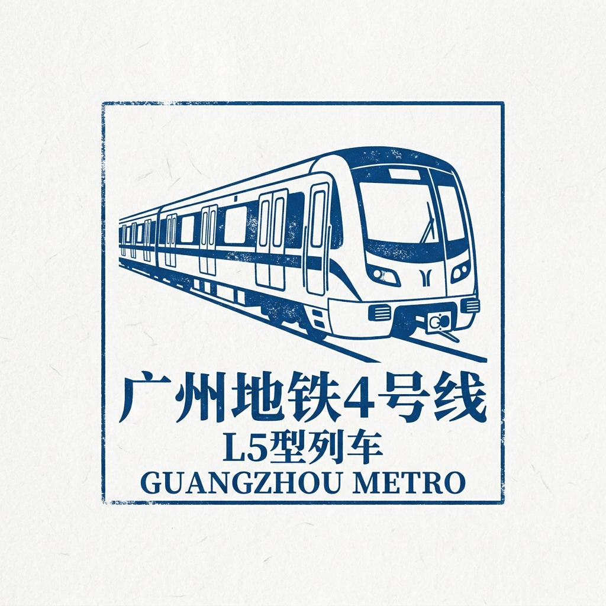

# 🟢 Guangzhou Metro Line 4 — The University Island Explorer!

## Quick Intro

Line 4 is a north–south metro line in Guangzhou, shown in dark green on maps.
Its first section opened on December 26, 2005.
It runs from Huangcun (Transfer to Line 21) in the north all the way to Nansha Passenger Port in the south.
Line 4 was the first metro line in all of China to use a special type of train called a Linear Induction Motor train.

## Story Time

Before Line 4, Guangzhou was building a brand-new university island called Xiaoguwei Island.
The island sits in the Pearl River, and ten universities were opening there.
Tens of thousands of students needed a reliable way to travel between the city center and the island every day.
At the same time, the city wanted to connect its fast-growing southern district, Nansha, to the rest of Guangzhou.
Nansha was planned as a major port and new city area, but it had very few transport links.
Line 4 was designed to do both: cross the river to serve the university island and keep going south all the way to Nansha.
The first section opened in December 2005, giving students a real metro ride to campus.
Over the next twelve years, the line grew step by step.
By 2017, Line 4 finally reached Nansha Passenger Port in the south.
Today, Line 4 carries students, workers, and travelers across four different districts every day.

## Time Story

- **2005**: The first section, from Xinzao to Wanshengwei (Transfer to Line 8 & Tram Haizhu), opened on December 26.
- **2006–2007**: Extensions pushed the line south, reaching Jinzhou and Huangge.
- **2009–2010**: The line grew northward, extending to Chebeinan and then Huangcun (Transfer to Line 21).
- **2017**: The southern end reached Nansha Passenger Port on December 28.

Line 4 grew in stages over more than twelve years.
Each new section connected more people to Guangzhou's growing metro network.

## Challenges Along the Way

- **Crossing the Pearl River**: Line 4 needed to reach Xiaoguwei Island, which is surrounded by the Pearl River. Engineers built bridges and tunnels to cross the water safely, using designs specially made for LIM trains.
- **New train technology**: Line 4 was China's first LIM metro line, and no one in Guangzhou had run this kind of train before. Engineers had to learn how to build and operate it while the project was underway.
- **Soft ground near rivers**: The land close to the Pearl River is soft and full of water. Workers had to use special techniques to stop the tunnels from sinking or flooding during construction.
- **Reaching a remote district**: Nansha was far from the city center with few existing transport links. Building a 60-kilometer line all the way there required careful planning and a long construction timeline.

## Route Snapshot

- **Start area**: Huangcun (Transfer to Line 21) (黄村), in Tianhe District to the north
- **End area**: Nansha Passenger Port (南沙客运港), in Nansha District to the south
- **Route role**: A long north–south corridor linking Tianhe, Haizhu, Panyu, and Nansha districts
- **Transfer value**: Connects to Line 8 at Wanshengwei (Transfer to Line 8 & Tram Haizhu); serves the Higher Education Mega Center with two dedicated stations; links to ferry services at Nansha Passenger Port

## Full Station List

1. **Huangcun (Transfer to Line 21)** (Transfer to Line 21)
2. **Chebei (车陂)**
3. **Chebei (车陂) South (Transfer to Line 5)** (Transfer to Line 5)
4. **Wanshengwei (Transfer to Line 8 & Tram Haizhu)** (Transfer to Line 8 & Tram Haizhu)
5. **Guanzhou**
6. **Higher Education Mega Center North**
7. **Higher Education Mega Center South (Transfer to Line 7 & Line 12)** (Transfer to Line 7 & Line 12)
8. **Xinzao**
9. **Guanqiao**
10. **Shiqi**
11. **Haibang (Transfer to Line 3)** (Transfer to Line 3)
12. **Dichong**
13. **Dongchong**
14. **Qingsheng**
15. **Huangge Auto Town**
16. **Huangge**
17. **Jiaomen**
18. **Jinzhou**
19. **Feishajiao**
20. **Guanglong**
21. **Dayong**
22. **Tangkeng**
23. **Nanheng**
24. **Nansha Passenger Port**

## Important Stations for Kids

### 1) Higher Education Mega Center South (Transfer to Line 7 & Line 12) (大学城南)

This station is right in the middle of Guangzhou's famous university island.
The island is called Xiaoguwei Island and sits in the Pearl River.
Ten universities are here, including Sun Yat-sen University (中大) and South China University of Technology.
Every day, tens of thousands of students ride this station to and from class.
Imagine going to school on an island full of universities — that is exactly what students do here!

### 2) Wanshengwei (Transfer to Line 8 & Tram Haizhu) (万胜围)

Wanshengwei (Transfer to Line 8 & Tram Haizhu) is the gateway between the older city districts and the southern part of Line 4.
You can transfer to Line 8 here to go to many other parts of Guangzhou.
For the first four years of Line 4, this was the northern end of the whole line.
It is still one of the busiest stations on Line 4 today.

### 3) Nansha Passenger Port (南沙客运港)

This is the southern end of Line 4.
Nansha is a large port district on the Pearl River Delta, close to the sea.
Near this station, there is a ferry terminal where you can take a boat to Hong Kong or Macau.
Nansha is also a growing new city area with modern buildings and businesses.
This station connects the metro all the way to the sea!

## Fun Facts

- Line 4 is about **60 kilometers** long — one of the longest metro lines in Guangzhou.
- It has **24 stations**.
- It was the **first metro line in China** to use Linear Induction Motor (LIM) trains.
- The line passes through **four districts**: Tianhe, Haizhu, Panyu, and Nansha.
- The Higher Education Mega Center on Xiaoguwei Island has **ten universities**.

## Word Helper

- **Linear Induction Motor (LIM)**: A special kind of engine that uses magnetic force to push the train forward, instead of spinning wheels. It helps trains go around tighter curves and fit inside smaller tunnels.
- **Pearl River Delta**: The area near the mouth of the Pearl River, where the river spreads into many channels before flowing into the sea.
- **Passenger Port**: A harbor where people can board boats to travel to other cities or places.

## Memory Check

1. What made the trains on Line 4 different from other metro lines in China when it opened?
2. Why did students need Line 4?
3. Where does Line 4 end in the south, and what can you do there?

## Photos

### Photo 1

- Caption: Guangzhou Metro Line 4 CRRC Sifang L5-Train.
- Source: [Wikimedia Commons](https://commons.wikimedia.org/wiki/File:Guangzhou%20Metro%20Line%204%20CRRC%20Sifang%20L5-Train.jpg)
- Photographer/Author: See Wikimedia Commons file page.
- Risk note: Low. Openly licensed source via Wikimedia Commons; external link availability may still change.

### Photo 2

- Caption: Guangzhou Metro Line 4 CSR Sifang L1-Train.
- Source: [Wikimedia Commons](https://commons.wikimedia.org/wiki/File:Guangzhou%20Metro%20Line%204%20CSR%20Sifang%20L1-Train.jpg)
- Photographer/Author: See Wikimedia Commons file page.
- Risk note: Low. Openly licensed source via Wikimedia Commons; external link availability may still change.

## Collector's Stamp

- **Description**: A minimalist blue ink stamp featuring the classic L5 train of Guangzhou Metro Line 4.

## Sources

- Line 4 (Guangzhou Metro) - Wikipedia: https://en.wikipedia.org/wiki/Line_4_(Guangzhou_Metro)
- Guangzhou Metro Line 4 - TravelChinaGuide: https://www.travelchinaguide.com/cityguides/guangdong/guangzhou/subway/line4.htm
- Guangzhou Higher Education Mega Center - Wikipedia: https://en.wikipedia.org/wiki/Guangzhou_Higher_Education_Mega_Center
- Design and Construction of Bridges on Guangzhou Metro Line 4: https://www.sciencedirect.com/science/article/pii/S1877705811010915
- Guangzhou Metro Line 4 Overview - MetroMan: https://www.metroman.cn/en/cities/guangzhou/lines/line-4
