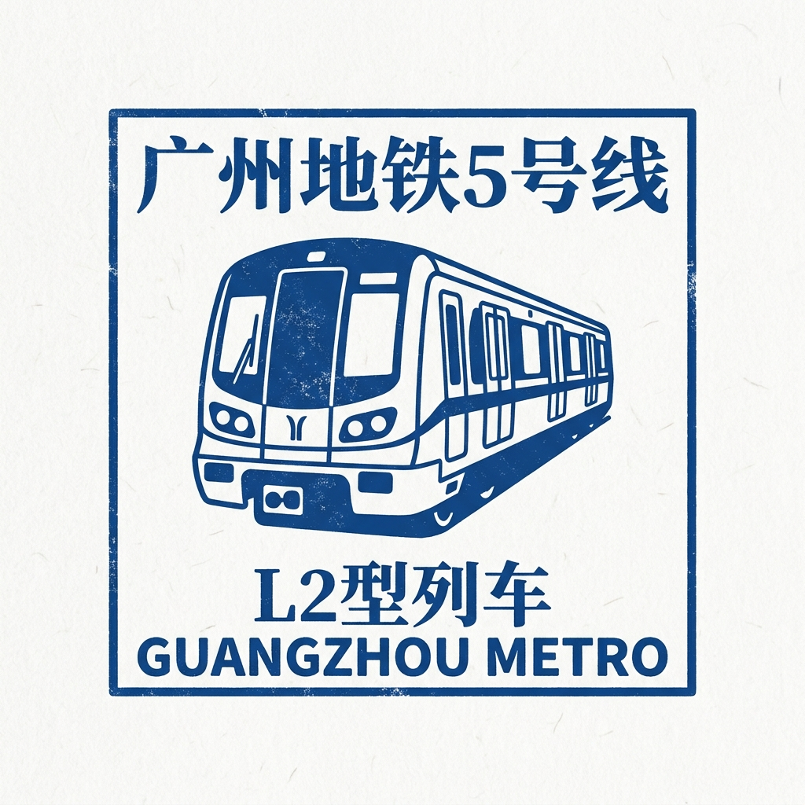

# 🔴 Guangzhou Metro Line 5 — The East–West Backbone!

## Quick Intro

Line 5 is an east–west metro line in Guangzhou, shown in red on maps.
It opened on December 28, 2009, running from Jiaokou in the west to Wenchong in the east.
The line was later extended eastward to Huangpu New Port in December 2023.
Today Line 5 has 30 stations and stretches about 41.7 kilometers across the city.

## Story Time

Before Line 5, traveling east to west across Guangzhou took a long time.
Buses got stuck in traffic, and there was no fast underground option linking the old city with the new business districts.
The city was growing quickly, especially in Zhujiang New Town (Transfer to Line 3) — Guangzhou's brand-new center of business and culture.
Zhujiang New Town (Transfer to Line 3) needed a metro connection to bring workers, visitors, and students there every day.
Line 5 was planned as a major east–west backbone, crossing through old city areas, the busy Guangzhou Railway Station (Transfer to Line 2, Line 11, Line 14, & Line 22), the new Zhujiang New Town (Transfer to Line 3), and reaching the eastern district of Huangpu.
When it opened on December 28, 2009, the response was enormous.
Just four days after opening, over 567,000 people rode Line 5 in a single day — more than the ten-year ridership target that planners had set.
Line 5 showed just how much Guangzhou had grown and how hungry the city was for fast east–west travel.

## Time Story

- **2009**: Line 5 opened on December 28, running 31.9 kilometers with 24 stations from Jiaokou to Wenchong.
- **2019**: Daily ridership surpassed 1.18 million people, making it one of Guangzhou's busiest lines.
- **2023**: An eastern extension opened on December 28, adding 6 new stations and reaching Huangpu New Port.

Line 5 has been one of Guangzhou's most heavily used metro lines since its first day.
It connects old city neighborhoods, major railway stations, and the heart of the modern city.

## Challenges Along the Way

- **Building under a crowded old city**: The line runs through Liwan and Yuexiu, old parts of Guangzhou packed with buildings, roads, and underground pipes. Engineers had to plan very carefully to avoid disrupting what was already there.
- **Complex interchange stations**: Building the station at Guangzhou Railway Station (Transfer to Line 2, Line 11, Line 14, & Line 22) was especially difficult because it connects with multiple other metro lines and handles enormous numbers of passengers every day.
- **Too many passengers too quickly**: Planners expected ridership to grow slowly, but the line was overwhelmed from day one. Just four days after opening, daily passengers exceeded the original ten-year forecast. Managing this unexpected demand required adding more trains and adjusting schedules.
- **Staying underground in tight city spaces**: Large parts of the line run deep underground through the densest parts of the city, where there was barely any room to dig and build.

## Route Snapshot

- **Start area**: Jiaokou (滘口), in Liwan District to the west
- **End area**: Huangpu New Port (黄埔新港), in Huangpu District to the east
- **Route role**: A major east–west backbone linking Liwan, Yuexiu, Tianhe, and Huangpu districts
- **Transfer value**: Connects to Line 3 at Zhujiang New Town (Transfer to Line 3); to Lines 2, 11, 14, and 22 at Guangzhou Railway Station (Transfer to Line 2, Line 11, Line 14, & Line 22); and to Line 6 at Tanwei (Transfer to Line 6)

## Full Station List

1. **Jiaokou**
2. **Tanwei (Transfer to Line 6)** (Transfer to Line 6)
3. **Zhongshanba (Transfer to Line 11)** (Transfer to Line 11)
4. **Xichang**
5. **Xicun (Transfer to Line 2 & Line 8)** (Transfer to Line 2 & Line 8)
6. **Guangzhou Railway Station (Transfer to Line 2, Line 11, Line 14, & Line 22)** (Transfer to Line 2, Line 11, Line 14, & Line 22)
7. **Xiaobei**
8. **Taojin**
9. **Ouzhuang (Transfer to Line 6)** (Transfer to Line 6)
10. **Zoo**
11. **Yangji (杨箕)** (Transfer to Line 1)
12. **Wuyangcun (Transfer to Line 10)** (Transfer to Line 10)
13. **Zhujiang New Town (Transfer to Line 3)** (Transfer to Line 3)
14. **Liede**
15. **Tancun**
16. **Yuancun (Transfer to Line 11)** (Transfer to Line 11)
17. **Keyun Lu**
18. **Chebei (车陂) South (Transfer to Line 5)** (Transfer to Line 4)
19. **Dongpu**
20. **Sanxi**
21. **Yuzhu (Transfer to Line 13)** (Transfer to Line 13)
22. **Dashadi**
23. **Dashadong (Transfer to Line 7)** (Transfer to Line 7)
24. **Wenchong**
25. **Shuanggang (Transfer to Line 13)** (Transfer to Line 13)
26. **Miaotou**
27. **Xiayuan (Transfer to Line 13)** (Transfer to Line 13)
28. **Baoshuiqu**
29. **Xiagang**
30. **Huangpu New Port**

## Important Stations for Kids

### 1) Zhujiang New Town (Transfer to Line 3) (珠江新城)

This station sits in the heart of Guangzhou's modern city center.
Right here you will find the Guangzhou Opera House (广州大剧院), the Guangzhou Museum, and the Guangdong Provincial Museum.
The Guangzhou Opera House (广州大剧院) was designed by world-famous architect Zaha Hadid and looks like two giant smooth river pebbles.
You can transfer to Line 3 here too.
One station puts you next to theaters, museums, and skyscrapers — all at once!

### 2) Guangzhou Railway Station (Transfer to Line 2, Line 11, Line 14, & Line 22) (广州火车站)

This is one of Guangzhou's oldest and busiest railway stations.
It opened in 1974 and still handles trains going to many cities across China.
At this metro station, you can transfer to Lines 2, 11, 14, and 22.
So many people pass through every day that it is one of the most crowded stations in the whole metro network.

### 3) Jiaokou (滘口)

Jiaokou is the western end of Line 5.
This station is built above ground, which means you can see the city around you from the platform.
Near the station is the Jiaokou Coach Terminal, where long-distance buses connect to many towns and cities outside Guangzhou.
It is a great example of how metro and bus services can work together.

## Fun Facts

- Line 5 is about **41.7 kilometers** long and has **30 stations**.
- Just four days after opening, ridership hit **567,000 in a single day** — more than the ten-year passenger forecast.
- The Guangzhou Opera House (广州大剧院) near Zhujiang New Town (Transfer to Line 3) station was designed by architect **Zaha Hadid**.
- Line 5 also uses **Linear Induction Motor (LIM)** train technology, like Line 4.

## Word Helper

- **Backbone line**: A major metro route that carries large numbers of passengers across a city from one side to the other.
- **Interchange station**: A station where you can switch to a different metro line.
- **Coach terminal**: A bus station where long-distance coaches depart for other towns and cities.

## Memory Check

1. How many people rode Line 5 in a single day just four days after it opened?
2. What famous building can you find near Zhujiang New Town (Transfer to Line 3) station?
3. Which direction does Line 5 run across the city?

## Photos

### Photo 1

- Caption: Guangzhou Metro Line 5 CSR Sifang L2 Train 023024 arriving Tanwei Station 2018 01.
- Source: [Wikimedia Commons](https://commons.wikimedia.org/wiki/File:Guangzhou%20Metro%20Line%205%20CSR%20Sifang%20L2%20Train%20023024%20arriving%20Tanwei%20Station%202018%2001.jpg)
- Photographer/Author: See Wikimedia Commons file page.
- Risk note: Low. Openly licensed source via Wikimedia Commons; external link availability may still change.

### Photo 2

- Caption: Guangzhou Metro Line 5 CSR Sifang L4-I Train 099100 arriving Tanwei Station 2018 01.
- Source: [Wikimedia Commons](https://commons.wikimedia.org/wiki/File:Guangzhou%20Metro%20Line%205%20CSR%20Sifang%20L4-I%20Train%20099100%20arriving%20Tanwei%20Station%202018%2001.jpg)
- Photographer/Author: See Wikimedia Commons file page.
- Risk note: Low. Openly licensed source via Wikimedia Commons; external link availability may still change.

### Photo 3

- Caption: Guangzhou Metro Line 5 CSR Sifang L4-II Train 113114 arriving Tanwei Station 2018 01.
- Source: [Wikimedia Commons](https://commons.wikimedia.org/wiki/File:Guangzhou%20Metro%20Line%205%20CSR%20Sifang%20L4-II%20Train%20113114%20arriving%20Tanwei%20Station%202018%2001.jpg)
- Photographer/Author: See Wikimedia Commons file page.
- Risk note: Low. Openly licensed source via Wikimedia Commons; external link availability may still change.

## Collector's Stamp

- **Description**: A minimalist blue ink stamp featuring the classic L2 train of Guangzhou Metro Line 5.

## Sources

- Line 5 (Guangzhou Metro) - Wikipedia: https://en.wikipedia.org/wiki/Line_5_(Guangzhou_Metro)
- Zhujiang New Town station - Wikipedia: https://en.wikipedia.org/wiki/Zhujiang_New_Town_Station
- Guangzhou Metro Line 5 - TravelChinaGuide: https://www.travelchinaguide.com/cityguides/guangdong/guangzhou/subway/line5.htm
- Guangzhou Metro Line 5 Overview - MetroMan: https://www.metroman.cn/en/cities/guangzhou/lines/line-5
- Guangzhou Opera House - Wikipedia: https://en.wikipedia.org/wiki/Guangzhou_Opera_House
