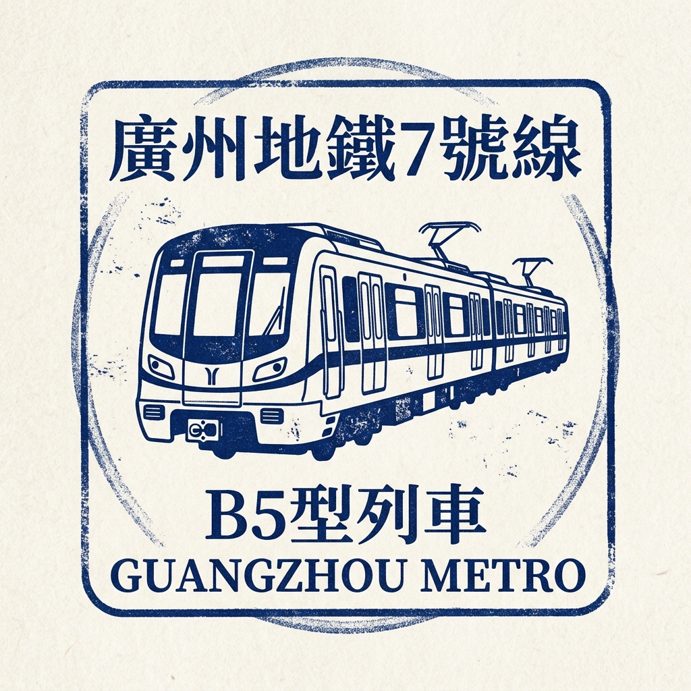

# 🟢 Guangzhou Metro Line 7 — The Scholar's Route!

## Quick Intro

Line 7 is Guangzhou's light green metro line.
It opened on December 28, 2016, and has since been extended to connect Shunde in Foshan with the Huangpu District in Guangzhou.
The line runs from Meidi Dadao in the west to Yanshan in the northeast.
Today, Line 7 carries students, travelers, and families across 27 stations.

## Story Time

Line 7 was originally built to connect the University Town (大学城) on Xiaoguwei Island with Guangzhou South Railway Station (广州南站).
University Town is a special place where ten universities are gathered on one island in the Pearl River.
Before Line 7, it was hard for students to reach the city's main high-speed rail hub.
When the first section opened in 2016, it changed everything!
But Line 7 didn't stop there. In 2022, it was extended westward into Shunde, a district in Foshan famous for its delicious food and the Midea company.
Then, in late 2023, it was extended northeast into Huangpu District, connecting even more neighborhoods and another science center.
Today, Line 7 is a truly "intercity" line, linking Foshan and Guangzhou and serving as a vital bridge between education, industry, and high-speed travel.

## Time Story

- **2016**: The first section opened on December 28, connecting HEMC South with Guangzhou South Railway Station (广州南站).
- **2022**: The western extension to Shunde (Meidi Dadao) opened on May 1.
- **2023**: The eastern extension to Yanshan in Huangpu District opened on December 28.

Line 7 has grown from a short shuttle into a major cross-city artery.
It connects the high-tech industries of Shunde, the transport hub of Guangzhou South, and the academic center of University Town.

## Challenges Along the Way

- **Intercity Coordination**: Extending the line into Foshan required Guangzhou and Foshan to work closely together on planning, construction, and operation.
- **River crossings**: The line crosses several branches of the Pearl River, requiring deep tunnels and careful engineering to keep the water out.
- **Building under the University island**: Working under Xiaoguwei Island meant tunneling through varied soil conditions while protecting the many university buildings above.
- **Connecting to a giant hub**: Integrating with Guangzhou South Railway Station (广州南站), one of the world's busiest, required complex construction to link with multiple other metro and rail lines.

## Route Snapshot

- **Start area**: Meidi Dadao (美的大道), in Shunde District, Foshan
- **End area**: Yanshan (燕山), in Huangpu District, Guangzhou
- **Route role**: An intercity line connecting Shunde, Panyu, and Huangpu districts
- **Transfer value**: Connects with Line 2, 22, and Foshan Line 2 at Guangzhou South Railway Station (广州南站); with Line 3 at Hanxi Changlong (Transfer to Line 3); with Line 18 at Nancun Wanbo (南村万博); with Line 4 and 12 at HEMC South; and with Line 6 at Luogang (萝岗).

## Full Station List

1. **Meidi Dadao**
2. **Beijiao Park (北滘公园)** (Transfer to Foshan Line 3)
3. **Midea**
4. **Nanchong**
5. **Jinlong**
6. **Chencun**
7. **Chencunbei**
8. **Dazhou**
9. **Guangzhou South Railway Station (广州南站)** (Transfer to Line 2, Line 22, & Foshan Line 2)
10. **Shibi (石壁)** (Transfer to Line 2)
11. **Xiecun**
12. **Zhongcun**
13. **Hanxi Changlong (Transfer to Line 3)** (Transfer to Line 3)
14. **Nancun Wanbo (南村万博)** (Transfer to Line 18)
15. **Yuangang**
16. **Banqiao**
17. **Higher Education Mega Center South (Transfer to Line 7 & Line 12) (HEMC South) (Transfer to Line 4 & Line 12)** (Transfer to Line 4 & Line 12)
18. **Shenjing**
19. **Changzhou**
20. **Yufengwei (裕丰围)** (Transfer to Line 13)
21. **Dashadong (Transfer to Line 7)** (Transfer to Line 5)
22. **Jitang**
23. **Jiazhuang**
24. **Kefenglu**
25. **Luogang (萝岗)** (Transfer to Line 6)
26. **Shuixi (水西)** (Transfer to Line 21 & Huangpu Tram 1)
27. **Yanshan**

## Important Stations for Kids

### 1) Higher Education Mega Center South (Transfer to Line 7 & Line 12) (HEMC South) (Transfer to Line 4 & Line 12) (大学城南)

This station is a major gateway to University Town on Xiaoguwei Island.
Ten universities share the island, including Sun Yat-sen University (中大) and South China University of Technology.
Students ride campus buses or walk between the different schools on the island.
It is like a small city built just for learning!
You can transfer to Line 4 and Line 12 here.

### 2) Guangzhou South Railway Station (广州南站)

This giant station is one of the busiest high-speed rail hubs in China.
Fast trains from here can reach cities like Shenzhen, Hong Kong, Beijing, and many more.
The station is so large that you need to walk quite a long way inside to reach the platforms.
Taking Line 7 here is a great way to start a fast train journey to another city.
You can transfer to Lines 2, 22, and Foshan Line 2 here.

### 3) Beijiao Park (北滘公园)

Located in Shunde, Foshan, this station is near beautiful parks and the headquarters of Midea, a famous appliance company.
It is a great example of how the metro connects different cities, making it easy to visit friends or family in Shunde for a delicious meal!
You can transfer to Foshan Line 3 here.

## Fun Facts

- Line 7 has **27 stations** in total.
- It is an **intercity line**, connecting Guangzhou and Foshan.
- University Town has **10 universities** sharing one island!
- Guangzhou South Railway Station (广州南站) is one of the **largest railway stations in the world** by floor area.
- Line 7 connects major transport hubs, academic centers, and industrial zones.

## Word Helper

- **High-speed rail**: A fast train system where trains travel much faster than regular trains. They can link faraway cities in just a few hours.
- **University Town**: A special area built so that many universities can share facilities and space together.
- **Transfer station**: A station where you can switch from one metro line to another.

## Memory Check

1. In which year did Line 7 open?
2. What is special about the island where University Town is located?
3. Which big railway station can you reach at the southern end of Line 7?

## Photos

### Photo 1

- Caption: Guangzhou Metro B5 train.
- Source: [Wikimedia Commons](https://commons.wikimedia.org/wiki/File:Guangzhou%20Metro%20B5%20train.jpg)
- Photographer/Author: See Wikimedia Commons file page.
- Risk note: Low. Openly licensed source via Wikimedia Commons; external link availability may still change.

### Photo 2

[%20at%20Guangzhou%20CRRC%20Base,%20Guangzhou%20Metro%2020230626.jpg?width=960)](https://commons.wikimedia.org/wiki/Special:FilePath/B5%20Train%20(07x021-022)%20at%20Guangzhou%20CRRC%20Base,%20Guangzhou%20Metro%2020230626.jpg)

- Caption: B5 Train (07x021-022) at Guangzhou CRRC Base, Guangzhou Metro 20230626.
- Source: [Wikimedia Commons](https://commons.wikimedia.org/wiki/File:B5%20Train%20(07x021-022)%20at%20Guangzhou%20CRRC%20Base,%20Guangzhou%20Metro%2020230626.jpg)
- Photographer/Author: See Wikimedia Commons file page.
- Risk note: Low. Openly licensed source via Wikimedia Commons; external link availability may still change.

## Collector's Stamp

- **Description**: A minimalist blue ink stamp featuring the classic B5 train of Guangzhou Metro Line 7.

## Sources

- Guangzhou Metro official site: https://www.gzmtr.com
- Line 7 (Guangzhou Metro) — Wikipedia: https://en.wikipedia.org/wiki/Line_7_(Guangzhou_Metro)
- Guangzhou University Town — Wikipedia: https://en.wikipedia.org/wiki/Guangzhou_University_Town
- Guangzhou South railway station — Wikipedia: https://en.wikipedia.org/wiki/Guangzhou_South_railway_station
- Xilang station — Wikipedia: https://en.wikipedia.org/wiki/Xilang_station
