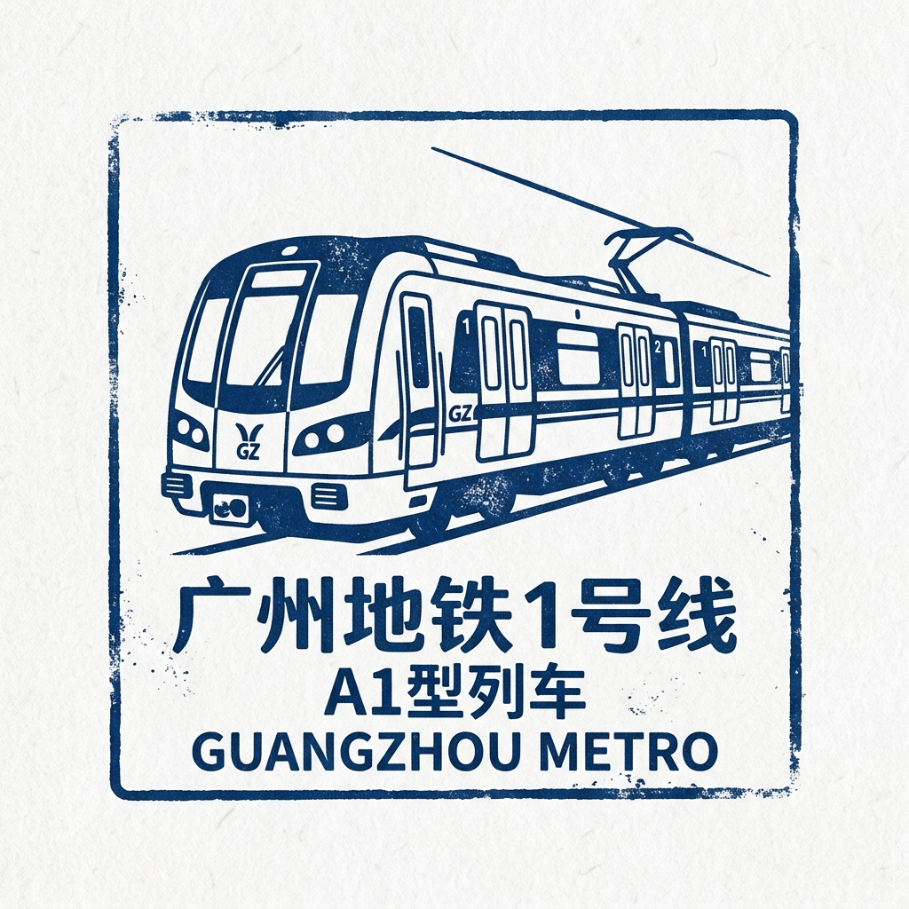

# 🟡 广州地铁1号线 — 第一场地下大冒险！

## 快速介绍

1号线是广州的第一条地铁线路。
1997年6月28日，首通段开通，广州也成为华南地区第一个开通地铁的内地城市。
1999年6月28日，全线从西塱通到广州东站。
直到今天，1号线仍然是一条设有16座车站的重要东西向线路。

## 故事时间

在1号线出现以前，很多人要靠公交车和繁忙的马路穿过广州。
随着城市越来越大，地面出行常常又慢又挤。
城市规划者想修一条能快速运送很多乘客的轨道线路，穿过城市的重要区域。
1993年12月28日，1号线正式开工建设。
1997年首通段开通时，广州证明了自己能够建设和运营现代地铁。
1999年全线开通后，它把老城区、商业区和大型火车站连了起来。
直到今天，1号线仍然很重要，因为后来的广州地铁网络从它身上学到了很多经验。

## 时间故事

- **1993年**：12月28日，1号线开工建设。
- **1997年**：6月28日，西塱到黄沙的首通段开通。
- **1999年**：6月28日，西塱到广州东站的全线开通。

1号线是广州整张地铁网故事的起点。
它让城市有了更快的东西向出行方式，也为后来的线路打下了基础。

## 线路概览

- **起点区域**：西塱（广州西南部）
- **终点区域**：广州东站（东部天河区）
- **线路作用**：穿过多个重要城区的东西向骨干线路
- **换乘价值**：可与多条后来的线路换乘，比如在公园前换乘2号线、在体育西路和广州东站换乘3号线、在黄沙和东山口换乘6号线

## 完整车站列表

1. **西塱** 🔄 10号线、22号线、广佛线
2. **坑口**
3. **花地湾**
4. **芳村** 🔄 11号线、22号线
5. **黄沙** 🔄 6号线
6. **长寿路**
7. **陈家祠** 🔄 8号线
8. **西门口**
9. **公园前** 🔄 2号线
10. **农讲所**
11. **烈士陵园** 🔄 12号线
12. **东山口** 🔄 6号线
13. **杨箕** 🔄 5号线
14. **体育西路** 🔄 3号线、10号线、13号线
15. **体育中心**
16. **广州东站** 🔄 3号线、11号线

## 小朋友值得看的车站

### 1）陈家祠站

这个站旁边就是有名的陈家祠。
陈家祠由广东陈氏宗族在清朝晚期修建。
今天，这里是广东民间工艺博物馆。
小朋友可以看到木雕、石雕和色彩丰富的屋顶装饰。

### 2）公园前站

公园前站位于旧城区中心的人民公园地下。
它是广州最繁忙的车站之一。
当2号线在这里与1号线相连后，它成了广州地铁最早的重要换乘站。
这里就像一个巨大的地下十字路口。

### 3）广州东站

这里是1号线的东端终点。
它把地铁、大型火车站和公交枢纽连在一起。
旅客可以从这里继续前往深圳和许多其他城市。
它很好地告诉我们，一个车站也能连接很多种交通方式。

## 趣味知识

- 1号线全长大约 **18.5公里**。
- 它一共有 **16座车站**。
- 其中 **14座在地下**，**2座在地面上**。
- 首通段在 **1997年** 开通，全线在 **1999年** 开通。

## 词语小帮手

- **骨干线路**：在城市里承担很多客流的主要线路。
- **换乘站**：可以转到另一条地铁线的车站。
- **民间工艺**：地方上流传下来的传统手工艺术，比如雕刻、陶器和刺绣。

## 记忆小测验

1. 1号线的第一段是哪一年开通的？
2. 陈家祠站附近可以参观哪一座博物馆？
3. 为什么公园前站在地铁网络里很重要？

## 照片

### 照片1

[%20leaving%20Kengkou%20Station,%20Guangzhou%20Metro%2020191013-A.jpg?width=960)](https://commons.wikimedia.org/wiki/Special:FilePath/A1%20Train%20(1x25-26)%20leaving%20Kengkou%20Station,%20Guangzhou%20Metro%2020191013-A.jpg)

- 说明：A1 Train (1x25-26) leaving Kengkou Station, Guangzhou Metro 20191013-A。
- 来源：[Wikimedia Commons](https://commons.wikimedia.org/wiki/File:A1%20Train%20(1x25-26)%20leaving%20Kengkou%20Station,%20Guangzhou%20Metro%2020191013-A.jpg)
- 摄影师/作者：请查看 Wikimedia Commons 文件页。
- 风险说明：低。来源为Wikimedia Commons开放授权资源，但外部链接可用性仍可能变化。

### 照片2

- 说明：A1 Train at Huadiwan Station, Guangzhou Metro 20191013。
- 来源：[Wikimedia Commons](https://commons.wikimedia.org/wiki/File:A1%20Train%20at%20Huadiwan%20Station,%20Guangzhou%20Metro%2020191013.jpg)
- 摄影师/作者：请查看 Wikimedia Commons 文件页。
- 风险说明：低。来源为Wikimedia Commons开放授权资源，但外部链接可用性仍可能变化。

### 照片3

[.jpg?width=960)](https://commons.wikimedia.org/wiki/Special:FilePath/Guangzhou%20Metro%20A1%20Train%20Leaving%20Xilang%20Station%20(8814180948).jpg)

- 说明：Guangzhou Metro A1 Train Leaving Xilang Station (8814180948)。
- 来源：[Wikimedia Commons](https://commons.wikimedia.org/wiki/File:Guangzhou%20Metro%20A1%20Train%20Leaving%20Xilang%20Station%20(8814180948).jpg)
- 摄影师/作者：请查看 Wikimedia Commons 文件页。
- 风险说明：低。来源为Wikimedia Commons开放授权资源，但外部链接可用性仍可能变化。

## 收藏家印章

- **说明**：一款简约的蓝色墨水印章，展示了广州地铁1号线的经典A1型列车。

## 来源

- 广州地铁英文官网站点地图（网站地图）：https://www.gzmtr.com/en/site-map.html
- 广州地铁1号线官方页面：https://www.gzmtr.com/service/lines/line1/
- 英文维基百科 - 广州地铁1号线：https://en.wikipedia.org/wiki/Line_1_(Guangzhou_Metro)
- 维基教科书 - 广州地铁案例：https://en.wikibooks.org/wiki/Transportation_Deployment_Casebook/Guangzhou_Metro
- 英文维基百科 - 陈家祠：https://en.wikipedia.org/wiki/Chen_Clan_Ancestral_Hall
- TravelChinaGuide - 陈氏书院：https://www.travelchinaguide.com/attraction/guangdong/guangzhou/chen_family.htm
- TravelChinaGuide - 广州东站：https://www.travelchinaguide.com/china-trains/guangzhou-east-station.htm
- 英文维基百科 - 公园前站：https://en.wikipedia.org/wiki/Gongyuanqian_Station
