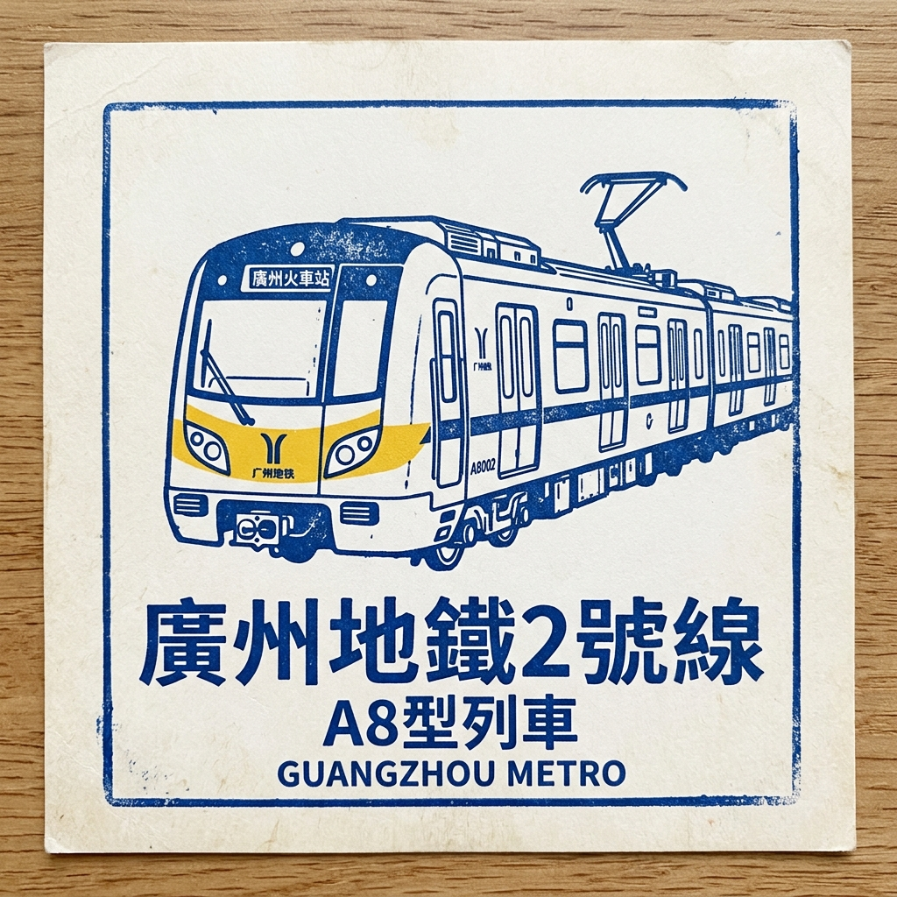

# 🔵 广州地铁2号线 — 南北大动脉！

## 快速介绍

2号线是广州南北方向的主干地铁线路，全线在地下行驶。
它连接了广州最重要的两座火车站：北边的广州站和南边的广州南站。
历经十多年分段建设，全线于2010年9月25日正式开通。
从嘉禾望岗到广州南站，全线共有24座车站，总长约31.4公里。

## 故事时间

在2号线建成之前，从广州一端到另一端既慢又难。
地面公交和道路非常拥挤，尤其是穿过繁忙的市中心。
城市规划者希望建一条南北向的快速轨道线路，把居民区、公园和大型火车站串连起来。
1999年6月，2号线开工建设。
2002年12月29日，第一段开通，乘客第一次能乘坐这条线路在地下穿行。
此后线路不断延伸，每年增加新站。
2010年，线路终于延伸到了崭新的广州南站——华南最重要的高铁枢纽之一。
今天，2号线每天运送超过百万名乘客，是广州最繁忙的线路之一。

## 时间故事

- **1999年**：6月，2号线开工建设。
- **2002年**：12月29日，第一段（三元里至小港）开通。
- **2003年**：6月28日，线路延伸至珠江一带更多地区。
- **2005年**：12月26日，再次延伸，向南新增多座车站。
- **2010年**：9月25日，嘉禾望岗至广州南站的全线正式开通。

2号线花了超过十年才建成今天的模样。
每一段新延伸，都让更多人和更多地方之间的距离更近了一步。

## 沿途的挑战

- **在珠江下面打隧道**：珠江横穿广州市区。在这条宽阔河流的松软水底土层中修建隧道非常困难。工程师必须使用专业的盾构机，并想尽一切办法在深挖时防止水渗入。
- **在繁忙的城市地下施工不停工**：广州市中心到处是道路、建筑和人。在这一切的下方挖隧道，又不损坏上方任何东西，需要极为谨慎的规划和持续监测。
- **分离共用轨道**：早期的2号线与后来变成8号线的路段共用了同一段轨道。2010年，工作人员必须在地下将两条线分开，让各自独立运行。这种地下分线工程需要多年时间才能精心完成。

## 线路概览

- **起点区域**：嘉禾望岗（北部白云区）
- **终点区域**：广州南站（南部番禺区）
- **线路作用**：连接两大铁路枢纽、穿过四个城区的南北骨干线路
- **换乘价值**：在公园前换乘1号线和12号线，在广州火车站换乘5号线，在广州南站换乘7号线和22号线，在昌岗换乘8号线

## 完整车站列表

1. **嘉禾望岗** 🔄 3号线、14号线
2. **黄边**
3. **江夏**
4. **萧岗**
5. **白云文化广场** 🔄 12号线
6. **白云公园**
7. **飞翔公园**
8. **三元里**
9. **广州火车站** 🔄 5号线、11号线、14号线
10. **越秀公园**
11. **中山纪念堂** 🔄 13号线
12. **公园前** 🔄 1号线、12号线
13. **海珠广场** 🔄 6号线
14. **市二宫**
15. **江南西**
16. **昌岗** 🔄 8号线
17. **江泰路** 🔄 11号线
18. **东晓南** 🔄 10号线
19. **南洲** 🔄 广佛线
20. **洛溪**
21. **南浦**
22. **会江**
23. **石壁** 🔄 7号线
24. **广州南站** 🔄 7号线、22号线

## 小朋友值得看的车站

### 1）中山纪念堂

这个站旁边有一座很特别的建筑——中山纪念堂。
它于1931年建成，是为了纪念帮助改变中国历史的著名领袖孙中山先生。
大楼有一个漂亮的蓝色琉璃瓦穹顶屋顶。
它是广州最具代表性的地标建筑之一。

### 2）广州站

这里是广州的大型国铁站。
全国各地的列车都在这里停靠。
地铁站把2号线和5号线连在一起，所以这里非常热闹。
几十年来，广州站一直是外地人进入广州的重要门户。

### 3）广州南站

这是全中国最大的高铁站之一。
它拥有28个站台——就像28条可以并排停放列车的轨道。
从这里出发的高铁，几个小时就能抵达北京、上海和许多其他城市。
乘坐地铁可以直接到达这座巨型车站的下层。

## 趣味知识

- 2号线全长约 **31.4公里**，共有 **24座车站**，全部在地下。
- 建设从 **1999年** 开始，全线于 **2010年** 开通，历时超过11年！
- 2019年，2号线单日客流量超过 **140万人次**。
- 广州南站拥有 **28个站台**，是全球最大的铁路枢纽之一。

## 词语小帮手

- **骨干线路**：在城市里承担大量客流的主干线路。
- **高速列车（高铁）**：可以以每小时数百公里速度行驶的超快列车。
- **综合交通枢纽**：可以换乘地铁、国铁列车、公交等多种交通方式的地方。

## 记忆小测验

1. 2号线连接了哪两座大型火车站？
2. 中山纪念堂站旁边有什么著名的地标建筑？
3. 2号线全线是哪一年完整开通的？

## 照片

### 照片1

- 说明：广州地铁2号线，中国第一条采用DC1500V刚性悬挂接触网供电的地铁线路。
- 来源：[中铁高铁电气装备股份有限公司](https://bjqcc.com/default/detail/417)
- 摄影师/作者：来源页未注明。
- 风险说明：中。图片来自公开网页，页面未清楚说明可再利用授权，且外部链接可用性仍可能变化。

### 照片2

[,%20Guangzhou%20Metro%2020230701-A.jpg?width=960)](https://commons.wikimedia.org/wiki/Special:FilePath/Exterior%20of%20A8%20Train%20(08x213),%20Guangzhou%20Metro%2020230701-A.jpg)

- 说明：于广交会展馆陈列展示的08x213。
- 来源：[Wikimedia Commons](https://commons.wikimedia.org/wiki/File:Exterior%20of%20A8%20Train%20(08x213),%20Guangzhou%20Metro%2020230701-A.jpg)
- 摄影师/作者：请查看 Wikimedia Commons 文件页。
- 风险说明：低。来源为Wikimedia Commons开放授权资源，但外部链接可用性仍可能变化。

## 收藏家印章

- **说明**：一款简约的蓝色墨水印章，展示了广州地铁广州地铁2号线的经典A8型列车。

## 来源

- 维基百科 - 广州地铁2号线：https://en.wikipedia.org/wiki/Line_2_(Guangzhou_Metro)
- UrbanRail.Net – 广州地铁：https://www.urbanrail.net/as/cn/guan/guangzhou.htm
- 维基百科 - 中山纪念堂站：https://en.wikipedia.org/wiki/Sun_Yat-sen_Memorial_Hall_station_(Guangzhou_Metro)
- 广州旅游指南 - 中山纪念堂：https://guangzhoutravelguide.com/sun-yat-sen-memorial-hall-guangzhou/
- 百度百科 - 广州地铁2号线：https://baike.baidu.com/en/item/Guangzhou%20Metro%20Line%202/663863
