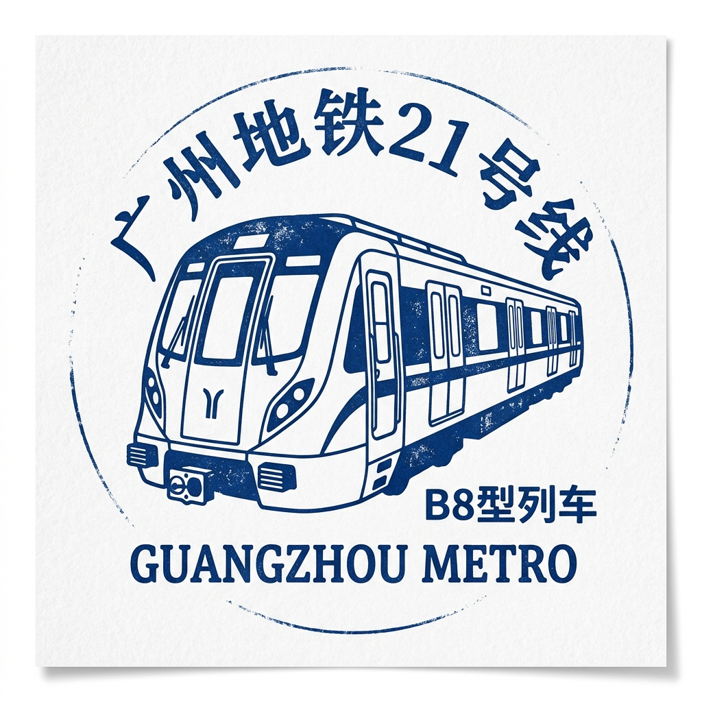

# 🌑 广州地铁21号线 — 东部快车！

## 快速介绍

21号线是连接广州市中心与东部增城区的重要快线。
它连接了天河区的天河公园与增城区的增城广场。
线路分两段开通，全线于2019年12月20日贯通运营。
目前，21号线共有20座车站，全长约61.5公里。

## 故事时间

在21号线建成之前，广州东部地区感觉离市中心非常遥远。
增城——东部的一片广阔区域——当时只有缓慢的公交线路将其与广州其他地区相连。
坐公交车可能需要一个多小时。
增城于2014年正式成为广州的一个区，因此城市需要一条快速通道来拉近两地的距离。

沿线位于黄埔区的科学城正发展成为主要的科技枢纽。
公司和研究人员纷纷搬到那里，但从市中心出发的旅程依然缓慢。

城市规划者决定将21号线建设为一条东部走廊地铁。
施工队伍在天河与增城之间多山且复杂的地形中开凿隧道。
当全线于2019年12月20日贯通时，从市中心前往增城广场的旅程变得更加快捷。

21号线直到今天依然非常重要，因为东部郊区的成千上万名上班族、学生和家庭每天都依靠它前往市中心。

## 时间故事

- **2018年**：12月28日，镇龙至增城广场段开通。
- **2019年**：12月20日，全线贯通运营（后来员村站移交给11号线，21号线改以天河公园为终点）。

21号线将缓慢、疲惫的公交之旅变成了平稳的地铁之旅。
它通过提供常规车和快车服务，大大缩短了长途旅行的时间。

## 建设中的挑战

- **穿越丘陵地带的长距离施工**：21号线必须延伸经过东部郊区最长的路线之一。天河与增城之间的地形包括丘陵和坚硬的岩石，这使得挖掘隧道比在平坦的市中心更加困难。
- **穿过繁忙城区**：线路的大部分路段运行在黄埔区繁忙的道路和住宅区下方。工人们必须小心挖掘，以免影响上方的房屋、道路和已有的地下管线。
- **在尚未开发的区域建设终点站**：在规划线路时，东端终点增城广场周边仍在开发中。工程师们必须在城市围绕车站生长的过程中同步建设车站和车辆段。

## 线路概览

- **起点区域**：天河公园（天河区，西端终点）
- **终点区域**：增城广场（增城区，东端终点）
- **线路作用**：连接市中心、科学城与增城的高速东部走廊
- **换乘价值**：在天河公园换乘11号线和13号线；在黄村换乘4号线；在苏元换乘6号线；在水西换乘7号线；在镇龙换乘14号线

## 完整车站列表

1. **天河公园** 🔄 11号线、13号线
2. **棠东**
3. **黄村** 🔄 4号线
4. **大观南路**
5. **天河智慧城**
6. **神舟路**
7. **科学城**
8. **苏元** 🔄 6号线
9. **水西** 🔄 7号线
10. **长平**
11. **金坑**
12. **镇龙西**
13. **镇龙** 🔄 14号线
14. **中新**
15. **坑贝**
16. **凤岗**
17. **朱村**
18. **山田**
19. **钟岗**
20. **增城广场**

## 小朋友值得看的车站

### 1）天河公园站

这是21号线的西端终点。
天河公园是广州市中心的一片大型绿地。
许多家庭周末都会来这里散步、玩耍和亲近自然。
坐完地铁后，你可以去公园里散散步！

### 2）科学城片区

在线路的中段，它穿过黄埔区的广州科学城。
这是一个高新技术企业、大学和科研机构聚集的特殊区域。
把它想象成聪明人发明新事物、建设未来的邻里社区！

### 3）增城广场站

这是线路的东端终点。
增城广场是增城区中心的一片大型公共区域。
周边环绕着商店、图书馆和政府大楼，是当地社区非常重要的枢纽。

## 有趣的小知识

- 21号线是广州首批提供“快车”服务的线路之一，快车会跳过较小的车站，让你更快到达目的地。
- 线路标志色是深紫色，在地铁线路图中非常显眼。
- 天河公园站是亚洲最大的地下地铁站之一！

## 词语小帮手

- **快车服务**：跳过部分车站以更快到达终点的列车。
- **走廊**：连接多个重要区域的主要交通干线。
- **亚洲之最**：天河公园站规模宏大，足以装下好几个普通车站！

## 记忆小测验

1. 21号线连接了哪个区与市中心？
2. 21号线的列车有什么特别之处？
3. 亚洲最大的地下车站之一位于哪里？

## 照片

### 照片1

[%20arriving%20at%20Mali%20Station.jpg?width=960)](https://commons.wikimedia.org/wiki/Special:FilePath/Guangzhou%20Metro%20B8%20(21031032)%20arriving%20at%20Mali%20Station.jpg)

- 说明：Guangzhou Metro B8 (21031032) arriving at Mali Station。
- 来源：[Wikimedia Commons](https://commons.wikimedia.org/wiki/File:Guangzhou%20Metro%20B8%20(21031032)%20arriving%20at%20Mali%20Station.jpg)
- 摄影师/作者：请查看 Wikimedia Commons 文件页。
- 风险说明：低。来源为Wikimedia Commons开放授权资源，但外部链接可用性仍可能变化。

### 照片2

- 说明：Guangzhou Metro B8 train is arriving at Changping Station。
- 来源：[Wikimedia Commons](https://commons.wikimedia.org/wiki/File:Guangzhou%20Metro%20B8%20train%20is%20arriving%20at%20Changping%20Station.jpg)
- 摄影师/作者：请查看 Wikimedia Commons 文件页。
- 风险说明：低。来源为Wikimedia Commons开放授权资源，但外部链接可用性仍可能变化。

### 照片3

[%20Arriving%20at%20Zhucun%20Station.jpg?width=960)](https://commons.wikimedia.org/wiki/Special:FilePath/Guangzhou%20Metro%20B8%20Train%20(21-5354)%20Arriving%20at%20Zhucun%20Station.jpg)

- 说明：Guangzhou Metro B8 Train (21-5354) Arriving at Zhucun Station。
- 来源：[Wikimedia Commons](https://commons.wikimedia.org/wiki/File:Guangzhou%20Metro%20B8%20Train%20(21-5354)%20Arriving%20at%20Zhucun%20Station.jpg)
- 摄影师/作者：请查看 Wikimedia Commons 文件页。
- 风险说明：低。来源为Wikimedia Commons开放授权资源，但外部链接可用性仍可能变化。

## 收藏家印章

- **说明**：一款简约的蓝色墨水印章，展示了广州地铁广州地铁21号线的经典B8型列车。

## 参考资料

- 广州地铁官方网站：https://www.gzmtr.com
- 维基百科 — 广州地铁21号线：https://en.wikipedia.org/wiki/Line_21_(Guangzhou_Metro)
- 中新广州知识城官方网站：https://www.ssgkc.com
- 广州黄埔区科学城概况 — 黄埔区政府：https://www.huangpu.gov.cn
