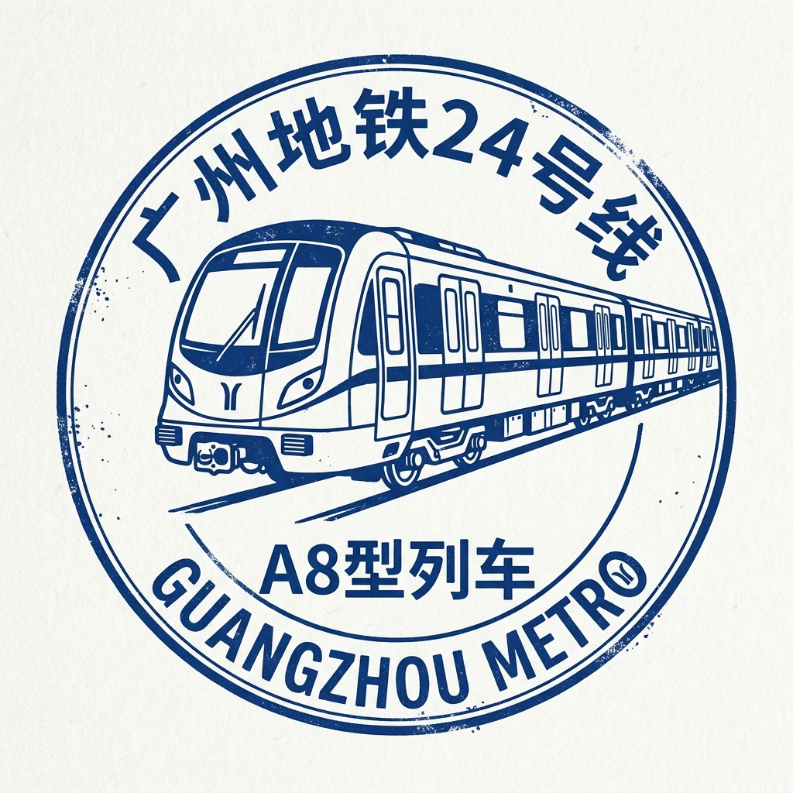

# ⭐ 24号线 — 北极星！

> ✨ **状态：** 截至2026年5月，24号线仍在**建设中**。它预计将成为连接北部郊区与市中心的重要南北大动脉！

## 🚉 快速了解
| | |
|---|---|
| 🎨 标志色 | 奶油色 / 淡黄色 |
| 🔢 车站 | **18座车站**（规划） |
| 📏 长度 | 约 31.7 公里 |
| 📏 方向 | 从花都区经白云区至越秀区 |

## 🌟 特别之处
像24号线这样的新地铁线，就像是在城市地图上画出的**新道路**！当它开通时，成千上万住在广州北部的人们将能比坐公交车更快地到达市中心。它将连接两座大型火车站：广州北站和全新的广州白云站。🌟

## 🎈 有趣的小知识！
在城市地下修建地铁线路是世界上**最艰巨的建筑工程**之一！工人们使用巨大的盾构机（TBM），它们像房子一样大 🏠，缓慢地钻开岩石和泥土，挖出火车运行的地下隧道。神奇吧？

## 🗺️ 规划车站列表
24号线将由北向南运行：

1. **广州北站** 🔄 9号线、高铁
2. **秀全公园**
3. **雅瑶**
4. **雅源**
5. **东镜**
6. **神山东**
7. **水沥**
8. **江府** 🔄 8号线
9. **桃源**
10. **均禾**
11. **白云大朗**
12. **夏茅** 🔄 22号线延伸线
13. **黄石**
14. **白云站** 🔄 12号线、22号线、8号线
15. **棠景**
16. **远景**
17. **梓元岗** 🔄 11号线
18. **纪念堂** 🔄 2号线、13号线

奶油色的标志色就像一页空白的纸——这条线路的故事仍在书写中！

## 照片

### 照片1

[,%20Guangzhou%20Metro%2020230701-A.jpg?width=960)](https://commons.wikimedia.org/wiki/Special:FilePath/Exterior%20of%20A8%20Train%20(08x213),%20Guangzhou%20Metro%2020230701-A.jpg)

- 说明：一列在广交会展馆陈列展示的08x213。
- 来源：[Wikimedia Commons](https://commons.wikimedia.org/wiki/File:Exterior%20of%20A8%20Train%20(08x213),%20Guangzhou%20Metro%2020230701-A.jpg)
- 摄影师/作者：请查看 Wikimedia Commons 文件页。
- 风险说明：临时占位图。24号线尚未投入运营，目前尚无真实的24号线列车照片。这张广州地铁列车照片仅作为展示，直到官方24号线车辆图像发布。

## 收藏家印章

- **说明**：一款简约的蓝色墨水印章，展示了广州地铁24号线的经典A8型列车。
